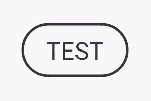

# KTLoadingButton

Simple loading button for kotlin andorid apps.
This button can show results in a nicely designed way to not block the ui while the user is waiting.

[](https://jitpack.io/#timonknispel/KTLoadingButton)
[](https://jitpack.io/#timonknispel/KTLoadingButton)
<br/>

[](https://github.com/timonknispel/KTLoadingButton/issues)

<br/>
[](https://github.com/timonknispel/KTLoadingButton/blob/master/LICENSE)

|SUCCESS| ERROR | PROGRESS |
|--|--| -- |
|  |  |  |


## Installation
1. Add the JitPack repository to your build file

```css
allprojects {
		repositories {
			...
			maven { url 'https://jitpack.io' }
		}
	}
```

2.  Add the dependency

```css
dependencies {
		implementation 'com.github.timonknispel:KTLoadingButton:XXXX'
	}
```
Where XXXX need to be replaced by the version showen in the badge above.

## Usage
### Example needed?  Look inside the app folder

1. Add the KTLoadingButton to your layout

```xml
<de.timonknispel.ktloadingbutton.KTLoadingButton  
  android:id="@+id/test_button"  
  android:layout_width="wrap_content"  
  android:layout_height="wrap_content"  
  app:buttonName="Test"  
 />
```
2. DONE
Now all you have to do is to start the button. This can be done in several ways.

#### Option 1: INTERMEDIATE (DEFAULT)
Simply call :
```kotlin
test_button.startLoading()
````

This will start the loading animation of the button. By default it should now intermediate.

When loading is done simply call:
```kotlin
test_button.doResult(success: Boolean)
```
This will stop the loading animation an start the result animation according to the given success.
Optional you can add a callback if you want to know when the animation is done:
```kotlin
test_button.doResult(success: Boolean) {
// do stuff here
}
```

#### Option 2: PROGRESS
Add the progressStyle option to your xml layout:
```xml
<de.timonknispel.ktloadingbutton.KTLoadingButton  
  android:id="@+id/test_button"  
  android:layout_width="wrap_content"  
  android:layout_height="wrap_content"  
  app:buttonName="Test"  
  app:progressStyle="PROGRESS"  
  />
```
All you have to do now is to call:
```kotlin
test_button.setProgress(progress: Float)
```
to show the progress.

## Good to know

 - You can add a callback to the button if you need the click event even if the button is in loading state:
```kotlin
test_button.touchListener = {
// do some stuff
}
```
This can be handy if for example want the user to cancel the loading process.

- You can reset the button by calling:
```kotlin
test_button.reset()
```

## Customization

### In XML
|Attribute| Value/s | Description| Required | Default |
|--|--| -- | -- | -- |
| buttonName | String | Sets the text for the button |[x]| |
| buttonTextSize | Dimension (SP) | Sets the text size for the button |[]| 16sp |
| allCaps | Boolean | If set to true all button text will be in caps |[]| true |
| buttonColor | Color | Sets the color for the button text and progress |[]| #373737|
| loadingBackgroundColor | Color | Sets the background color for a failed result |[]| buttonColor with transparency of 31% |
| succeedColor | Color | Sets the background color for a success result |[]|#4CAF50 |
| failedColor | Color | Sets the background color for a failed result |[]|#F44336 |
| autoResetButtonAfterResult | Boolean | Decides if the button should reset itself after the result was displayed (after 1,5 seconds) |[]| true |
| progressStyle | [INTERMEDIATE or PROGRESS] | Decides if the button should intermediate or display a progress |[]| INTERMEDIATE |
| border_thickness | Dimension (DP) | sets the thickness of the outline border and progress circle |[]| 1dp |
